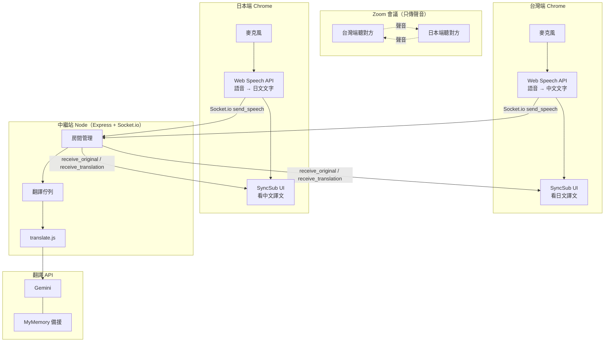
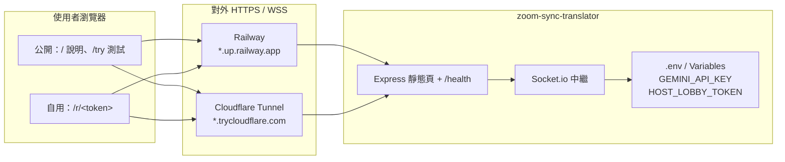
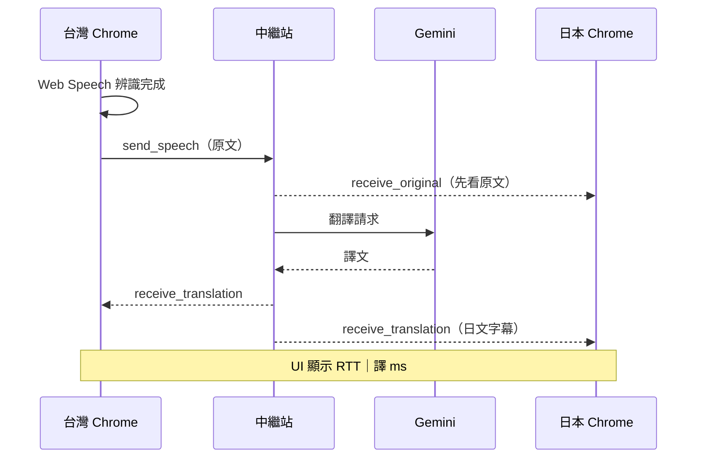
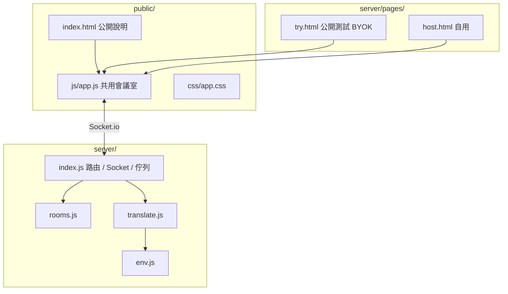
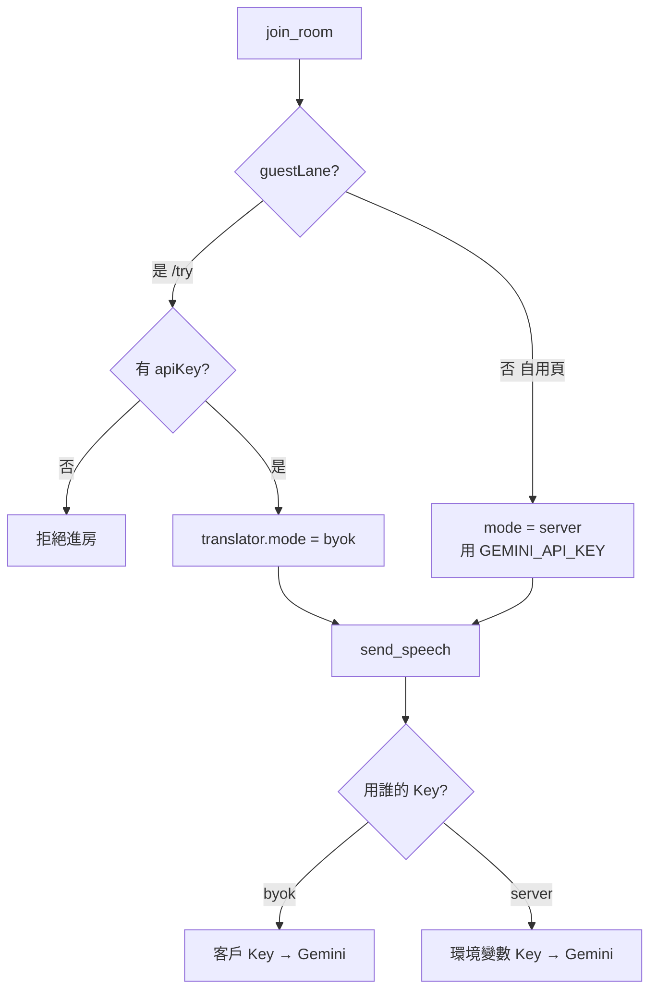

# SyncSub 架構圖

> 更新：2026-09-08  
> Zoom 傳聲音；SyncSub 傳雙語字幕。

---

## 1. 整體架構（誰做什麼）

**重點：** 不抓 Zoom 系統音；雙方各自開 SyncSub，用**自己的麥克風**。

---

## 2. 部署／入口（同一套服務，兩種對外方式）

| 入口 | 路徑 | 翻譯誰付錢 |
|------|------|------------|
| 公開說明 | `/` | — |
| 公開測試 | `/try`（舊 `/guest`） | 測試者自己的 Key（BYOK） |
| 站長自用 | `/r/<HOST_LOBBY_TOKEN>` | 伺服器 `GEMINI_API_KEY` |

---

## 3. 一句話資料流（時間序）

---

## 4. 軟體模組

---

## 5. 額度分流（公開 vs 自用）

---

## 相關文件

- [整體程序與過程.md](./整體程序與過程.md)
- [公開版與自用版-網址與參數.md](./公開版與自用版-網址與參數.md)
- [本機Cloudflare-Tunnel.md](./本機Cloudflare-Tunnel.md)
- [從Railway遷移.md](./從Railway遷移.md)
